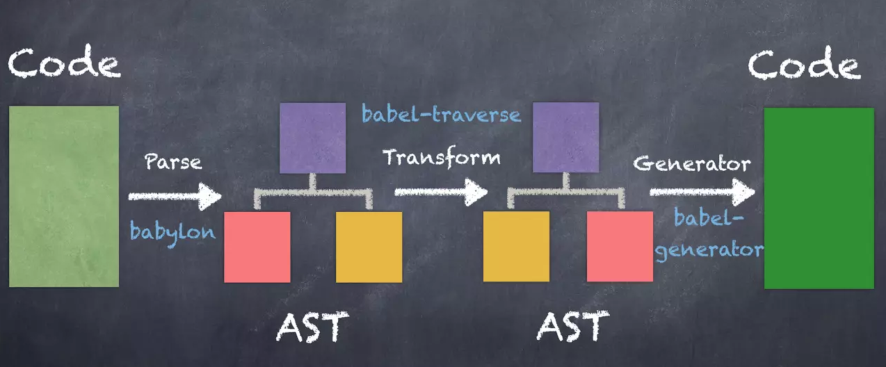

up
---
babel是我个人前端编译学习的重要学习资料，真正让我对babel入门的是[这一篇文章](https://juejin.im/post/5c21b584e51d4548ac6f6c99)。
 
最主要的就是讲了这张图，秒懂这张图的同学，接下来只需要多练、多看基本就没有什么问题了。
 
 

 

入门第一步：babel三板斧
---
- [babylon](https://github.com/babel/babylon)
- [babel-traverse](https://github.com/thejameskyle/babel-handbook/blob/master/translations/en/plugin-handbook.md#babel-traverse)
- [babel-generator](https://github.com/babel/babel/tree/master/packages/babel-generator)

声明一点：本仓库不只是对javascript语法、结构的处理，还会结合视图层渲染一起杂着记录，因为只是将babel单独拎出来，你会发现没有什么好讲的。
 
 
当然可以写几个具体的demo，但是在实际项目中，其实babel只是起到其中一个开箱即用的"老虎钳"作用。

学习历程记录，下面是具体的参考资料清单
---
这里只列举个人看过，实践过，然后觉得有用的。
     
**列表如下：**       
- [深入babel，看这一篇就够了](https://juejin.im/post/5c21b584e51d4548ac6f6c99)
- [平庸前端码农之蜕变 — AST](https://juejin.im/post/5bfc21d2e51d4544313df666)
- babel官网推荐如何实现一个微型compiler（挺不错） => [the-super-tiny-compiler](https://github.com/jamiebuilds/the-super-tiny-compiler)
-  前端如何学习编译，编译可以做什么 => [前端要以正确的姿势学习编译原理](https://zhuanlan.zhihu.com/p/36301857?hmsr=toutiao.io&utm_medium=toutiao.io&utm_source=toutiao.io)
- babel入门基础 => [babel用户手册](https://github.com/jamiebuilds/babel-handbook/blob/master/translations/zh-Hans/user-handbook.md)
- babel进阶插件 => [babel插件手册](https://github.com/jamiebuilds/babel-handbook/blob/master/translations/zh-Hans/plugin-handbook.md)

 
 
 
